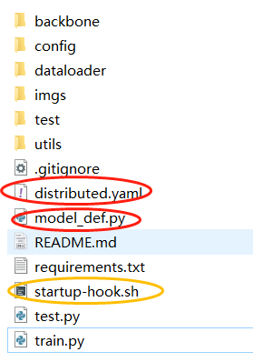
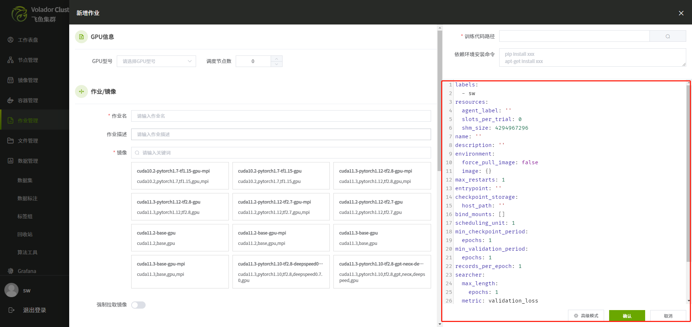
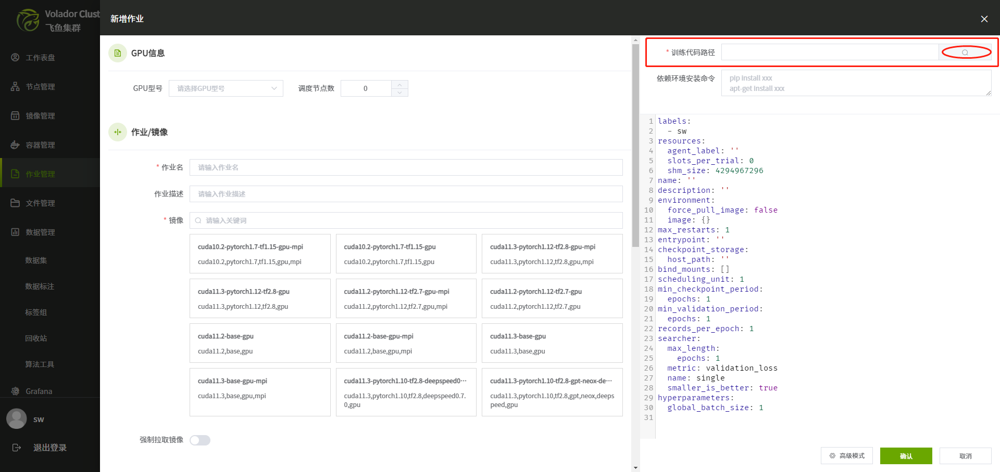
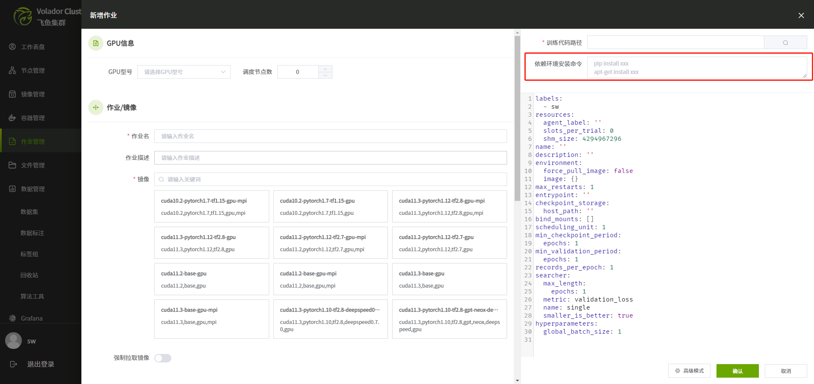

# 

# 核心概念

## 飞鱼集群作业系统简介

 飞鱼集群的作业系统默认使用horovod作为分布式作业的底层调度器，来进行多机多卡的深度学习AI训练任务。对于horovod的一些核心概念与特性，请参考[这里](https://horovod.readthedocs.io/en/stable/summary_include.html#supported-frameworks)。

## 飞鱼集群作业系统的工作流程

飞鱼集群提供了大量的分布式作业镜像，用户按照自己的需求选择合适的镜像。用户需要准备作业代码工程和数据集。代码工程和数据集可通过文件管理系统上传。完成镜像选择后，飞鱼集群会在宿主机上启动相应的作业容器。数据集可通过挂载的方式，映射到作业容器内部。在完成作业后自动回收容器，释放资源。

## 飞鱼集群作业引导

### 所需文件

飞鱼集群的作业系统涉及到3个文件，至少需要`2`个相关文件才可以运行。以faster-rcnn为例，完整的代码工程在[这里](https://github.com/caiduoduo12138/volador/blob/master/examples/faster-rcnn-test-ddp.zip)。如下图：



`distributed.yaml`是实验的配置文件，`model_def.py`是模型代码文件，这两个文件是必要的。`startup-hook.sh`是一个shell脚本，用来配置缺失的一些环境依赖，例如在该文件中写`pip install xxx`, `apt-get install xxx`。当您选择的镜像并不缺失您所需要的依赖时，该文件不是必要的。

对于代码工程中的其他文件，是用户自己的深度学习代码，或者github等代码仓库下载得到。用户想提交飞鱼集群的作业时，仅需要增加上述所需的几个文件即可。一些常见的用法在[imagenet](https://github.com/caiduoduo12138/volador/blob/master/examples/imagenet-r50-test-ddp.zip)工程中。

### 如何生成这三个文件

这里介绍如何使用飞鱼集群的作业系统生成所需的文件。`distributed.yaml`通过如下界面生成，单击确定后，系统会自动生成该配置文件。



`model_def.py`是需要用户自己编写(具体编写规则请参考下文)，我们在训练代码路径包含到该文件的位置，即代码工程位置（另外两个文件与它也需要在同一个层级），如图：



`startup-hook.sh`通过如下界面生成：



```
注意：数据集请不要放在代码工程文件下，建议使用挂载的方式，对应distributed.yaml中的
bin_mounts字段。
```

### 总结

用户将自己的代码工程打包，然后添加所需的3个文件即可进行飞鱼集群的作业调度。

```
distributed.yaml   # 实验配置文件，系统可帮助生成
model_def.py  # 模型代码文件，需要用户按照我们的api规则进行编写
startup-hook.sh  # 依赖安装，非必需，系统可帮助生成
```

关于使用飞鱼集群的作业系统出现的问题，我们建立了github[交流社区](https://github.com/caiduoduo12138/volador)，欢迎提问，我们将尽力解答。

# 入门

## 教程

### 运行第一个实验

在本教程中，我们将向您展示如何将训练示例与飞鱼集群(Volador Cluster)环境集成在一起。我们将在本地训练环境上运行我们的实验。

```
注意:本教程以MNIST手写体识别为例，推荐给刚接触飞鱼集群作业的深度学习AI模型开发人员。
```

代码文件在[这里](https://github.com/caiduoduo12138/test_git)。飞鱼集群的作业系统至少需要两个文件，一个`.yaml`（用来配置作业的相关信息），一个`.py`文件（用来定义模型结构、数据集、优化器等深度学习中常用的相关信息）。

在文件管理下解压代码文件，路径为`/public/mnist-test-ddp`。填写的信息如下：


完成填写后，点击确定，提交作业。

```
注意：需要保证所填参数一致，文件路径真实存在。
```

### PyTorch MNIST 教程

本教程描述了如何将现有的PyTorch模型移植到飞鱼集群作业系统。我们将MNIST数据集移植一个简单的图像分类模型。本教程基于官方的PyTorch MNIST示例。

要在飞鱼集群作业系统中使用PyTorch模型，你需要将模型移植到系统的API。对于大多数模型，这个移植过程是直接的，并且一旦模型被移植，那么飞鱼集群具备的特性都将可用。例如，您可以在不更改模型代码的情况下进行分布式训练或超参数搜索，并且将自动存储和可视化您的模型。

在训练PyTorch模型时，飞鱼集群提供了一个内置的训练循环，该循环将每个batch的训练数据馈送到`train_batch`函数中，该函数应该执行前向传递、反向传播并计算训练指标。此外，飞鱼集群还进行日志管理和设备初始化。要将模型代码插入指定的训练循环中，需要定义执行以下任务的方法:

- 初始化模型(model)、优化器(optimizer)和学习率调度器( LR scheduler)

- 定义前向传播(forward)和反向传播(backward)的训练函数

- 定义评估函数来计算验证数据集上的损失和其他度量

- 加载训练数据集

- 加载验证数据集

然后，训练循环将自动调用这些函数进行训练循环(train loop)。这些函数应该组织到一个`trial`类中，这是用户定义的Python类，继承自`determined.pytorch.PyTorchTrial`。下面介绍如何编写第一个`tria`l类，然后介绍如何使用飞鱼集群的作业系统来运行用户自定义的训练作业。

#### 构建一个 `PyTorchTrial` 类

下面是`trial`类的骨架结构：

```
import torch.nn as nn
from determined.pytorch import DataLoader, PyTorchTrial, PyTorchTrialContext


class MNISTTrial(PyTorchTrial):
    def __init__(self, context: PyTorchTrialContext):
        # Initialize the trial class and wrap the models, optimizers, and LR schedulers.
        pass

    def train_batch(self, batch: TorchData, epoch_idx: int, batch_idx: int):
        # Run forward passes on the models and backward passes on the optimizers.
        pass

    def evaluate_batch(self, batch: TorchData):
        # Define how to evaluate the model by calculating loss and other metrics
        # for a batch of validation data.
        pass

    def build_training_data_loader(self):
        # Create the training data loader.
        # This should return a determined.pytorch.Dataset.
        pass

    def build_validation_data_loader(self):
        # Create the validation data loader.
        # This should return a determined.pytorch.Dataset.
        pass
```

接下来我们详细地讲解如何实现该类中的每个函数，该类继承于PyTorchTrial类。

#### 构造函数`__init__`方法

与其他Python类一样，`__init__`方法被调用来构造我们的`trial`类。向这个方法传递一个参数`context`。`context`包含有关模型训练中的信息，例如超参数的值。所有模型(model)和优化器(optimizer)必须分别用我们提供的方法`wrap_model`和`wrap_optimizer`来包裹，它们是由`PyTorchTrialContext`提供的。在这个MNIST示例中，可以通过`context`提供的的`get_hparam()`方法访问模型的超参数的当前值。

```
def __init__(self, context: PyTorchTrialContext):
    # Store trial context for later use.
    self.context = context

    # Create a unique download directory for each rank so they don't overwrite each
    # other when doing distributed training.
    self.download_directory = f"/tmp/data-rank{self.context.distributed.get_rank()}"
    self.data_downloaded = False

    # Initialize the model and wrap it using self.context.wrap_model().
    self.model = self.context.wrap_model(
        nn.Sequential(
            nn.Conv2d(1, self.context.get_hparam("n_filters1"), 3, 1),
            nn.ReLU(),
            nn.Conv2d(
                self.context.get_hparam("n_filters1"),
                self.context.get_hparam("n_filters2"),
                3,
            ),
            nn.ReLU(),
            nn.MaxPool2d(2),
            nn.Dropout2d(self.context.get_hparam("dropout1")),
            Flatten(),
            nn.Linear(144 * self.context.get_hparam("n_filters2"), 128),
            nn.ReLU(),
            nn.Dropout2d(self.context.get_hparam("dropout2")),
            nn.Linear(128, 10),
            nn.LogSoftmax(),
        )
    )

    # Initialize the optimizer and wrap it using self.context.wrap_optimizer().
    self.optimizer = self.context.wrap_optimizer(
        torch.optim.Adadelta(
            model.parameters(), lr=self.context.get_hparam("learning_rate")
        )
    )
```

#### 加载数据

需要定义的方法是`build_training_data_loader`和`build_validation_data_loader`。飞鱼集群的作业系统分别使用这些方法来加载训练和验证数据集。这两个方法都应该返回一个类似于`torch.utils.data.DataLoader`的数据加载器 。

```
def build_training_data_loader(self):
    if not self.data_downloaded:
        self.download_directory = data.download_dataset(
            download_directory=self.download_directory,
            data_config=self.context.get_data_config(),
        )
        self.data_downloaded = True

    train_data = data.get_dataset(self.download_directory, train=True)
    return DataLoader(train_data, batch_size=self.context.get_per_slot_batch_size())


def build_validation_data_loader(self):
    if not self.data_downloaded:
        self.download_directory = data.download_dataset(
            download_directory=self.download_directory,
            data_config=self.context.get_data_config(),
        )
        self.data_downloaded = True

    validation_data = data.get_dataset(self.download_directory, train=False)
    return DataLoader(
        validation_data, batch_size=self.context.get_per_slot_batch_size()
    )
```

#### 定义`train_batch`方法

`train_batch()`方法从训练数据集中获得一个batch的数据;它应该对模型进行前向传播，对损失进行反向传播，并对优化器进行处理。这个方法应该返回一个包含用户自定义的训练指标的字典;飞鱼集群将自动对batch间的所有指标进行平均。如果将优化器设置为自动处理梯度归零，则`step_optimizer`将把梯度归零，并且不需要调用`optimizer.zero_grad()`。

```
def train_batch(self, batch: TorchData, epoch_idx: int, batch_idx: int):
    batch = cast(Tuple[torch.Tensor, torch.Tensor], batch)
    data, labels = batch

    # Define the training forward pass and calculate loss.
    output = self.model(data)
    loss = torch.nn.functional.nll_loss(output, labels)

    # Define the training backward pass and step the optimizer.
    self.context.backward(loss)
    self.context.step_optimizer(self.optimizer)

    return {"loss": loss}
```

#### 定义`evaluate_batch`方法

向`evaluate_batch()`方法传递来自验证数据集的单batch数据;它计算用户自定义的验证指标(metric)，并将它们作为将指标名称映射到字典返回。每个batch的验证指标被聚合，为整个验证集生成单个指标。默认情况下，验证指标是被平均处理的。

```
def evaluate_batch(self, batch: TorchData):
    batch = cast(Tuple[torch.Tensor, torch.Tensor], batch)
    data, labels = batch

    output = self.model(data)
    validation_loss = torch.nn.functional.nll_loss(output, labels).item()

    pred = output.argmax(dim=1, keepdim=True)
    accuracy = pred.eq(labels.view_as(pred)).sum().item() / len(data)

    return {"validation_loss": validation_loss, "accuracy": accuracy}
```

#### 训练模型

现在我们已经完成了模型代码的移植（完成.py文件编写），可以使用飞鱼集群的作业功能了。在飞鱼集群的作业系统中，trial(试验)是一个训练任务，它由一个数据集、一个深度学习模型和模型所有超参数的值组成。实验是一个或多个trial的集合:一个实验可以训练单个模型(使用单个`trial`)，也可以在用户定义的超参数空间上定义搜索(多个`trial`)。

为了创建一个实验，我们首先编写一个配置文件(.yaml)，该文件定义了我们想要运行的实验的类型。下面是一个yaml的示例：

```
name: mnist_pytorch_const
data:
  url: https://s3-us-west-2.amazonaws.com/determined-ai-test-data/pytorch_mnist.tar.gz
hyperparameters:
  learning_rate: 1.0
  global_batch_size: 64
  n_filters1: 32
  n_filters2: 64
  dropout1: 0.25
  dropout2: 0.5
records_per_epoch: 50_000
searcher:
  name: single
  metric: validation_loss
  max_length:
    epochs: 1
  smaller_is_better: true
entrypoint: model_def:MNistTrial
```

`entrypoint`指定了要使用的`trial`类的名称。一般情况下，代码工程会包含多个模型代码文件，那么指定文件名将是必要的。这种情况下，我们使用`model_def:MNistTrial`作为`entrypoint`的参数值，其中`model_def`是模型代码文件`model_def.py`不含后缀的文件名。关于yaml中的更多参数信息，请参考实验配置文件详解章节。

#### 评估模型

模型评估是系统自动完成的，用户只需在web浏览器访问相应界面即可获取相关信息（精度指标，损失等）。

### PyTorch 教程

飞鱼集群的作业系统为PyTorch和Keras提供了高级框架api，让用户在没有样板代码的情况下描述他们的模型。系统通过提供最先进的训练循环来减少样板文件，该循环提供分布式训练、超参数搜索、自动混合精度和许多其他特性。

在本教程中，我们将通过一个示例，成功地将PyTorch代码组织到`PyTorchTrial` 的API中。一旦你的代码是`PyTorchTrial`格式，你就可以很容易地利用飞鱼集群的作业系统来提交自定义的作业。

虽然多样的深度学习算法是不同的，但是执行深度学习训练的代码往往遵循一个范式，具有相同类型的代码结构。通常，由一个模型(model)，优化器(optimizer)，数据(dataset)，学习率调度器(LR scheduler)构成。我们建议按以下顺序提取源工程代码文件中的组件，以便进行飞鱼集群作业调度：

```
1.模型(model)
2.优化器(optimizer)
3.数据(dataloader)
4.训练验证过程(train/validate batch)
5.学习率调度(learning rate scheduler)
6.其他特性，例如automatic mixed precision(amp),梯度裁剪(gradient clipping)等
```

我们将源工程代码文件中的组件依次填入到`trial`类中对应的方法中，然后应用一个yaml配置文件来执行作业。

#### 准备

在开始之前，我们需要创建核心文件。确定需要定义两个文件:模型定义文化(.py)和实验配置文件(.yaml)。

#### 模型定义文件

模型定义文件包含一个`trial`类，下面是一个示例：

```
from typing import Any, Dict, Union, Sequence
from determined.pytorch import DataLoader, PyTorchTrial, PyTorchTrialContext

TorchData = Union[Dict[str, torch.Tensor], Sequence[torch.Tensor], torch.Tensor]

class MyTrial(PyTorchTrial):
    def __init__(self, context: PyTorchTrialContext) -> None:
        self.context = context

    def build_training_data_loader(self) -> DataLoader:
        return DataLoader()

    def build_validation_data_loader(self) -> DataLoader:
        return DataLoader()

    def train_batch(self, batch: TorchData, epoch_idx: int, batch_idx: int)  -> Dict[str, Any]:
        return {}

    def evaluate_batch(self, batch: TorchData) -> Dict[str, Any]:
        return {}
```

#### 实验配置文件

我们还需要创建一个实验配置文件。该文件定义了具体的实验信息，如:样本数量、训练轮次和超参数。我们建议将所有的超参数都添加到这个文件中，方便进行超参数调整、超参数搜索或者作业重启。

在本例中，不使用超参数搜索功能，示例如下：

```
name: imagenet-test # 作业名
description: ImageNet_PyTorch_const # 作业描述
hyperparameters: #超参数
    global_batch_size: 256
    dense1: 128
    data: /mnt/data
    arch: resnet18
    workers: 4
    start-epoch: 0
    lr: 0.1
    momentum: 0.9
    weight_decay: 1e-4
    pretrained: True
records1281167epoch: 12181167 # imagenet数据集中训练集的图片数量
searcher:
    name: single # 不使用超参数搜索
    metric: acc # 验证集指标
    smaller_is_better: false # 针对验证集指标保留最佳权重
    max_length:
        epochs: 10 # 训练10个epoch
entrypoint: model_def:ImageNetTrial # 作业入口文件及类名
max_restarts: 0 # 重启作业次数
```

关于实验配置文件yaml中的更多参数信息说明，请参考实验配置文件字段详解章节。

#### 模型

现在我们已经完成了准备工作，我们可以通过创建模型开始移植。模型代码将放在`trial`的`__init__()`函数中。我们使用`self.context.wrap_model()`包裹源代码中的model，该操作会自动地将模型转变为cuda，而不需要显示的指定`model.cuda()`。特别地，用户可以通过`self.context.get_hparams()`获取yaml文件中对应的超参数值。

```
def __init__(self, context: PyTorchTrialContext):
    self.context = context

    arch = self.context.get_hparam("arch")
    if self.context.get_hparam("pretrained"):
        print("=> using pre-trained model '{}'".format(arch))
        model = models.__dict__[arch](pretrained=True)
    else:
        print("=> creating model '{}'".format(arch))
        model = models.__dict__[arch]()

    self.model = self.context.wrap_model(model)
```

#### 优化器/损失函数

优化器(optimizer)及损失函数(loss)也将添加在`__init__`方法中，优化器需要被我们提供的`self.context.wrap_optimizer()`函数包裹。对于学习率调度器(LR Scheduler)，我们提供了一个`self.context.wrap_lr_scheduler()`函数来包裹`torch.optim.lr_scheduler`类下的学习率调度器。更新后的代码块为：

```
def __init__(self, context: PyTorchTrialContext):
    self.context = context

    arch = self.context.get_hparam("arch")
    if self.context.get_hparam("pretrained"):
        print("=> using pre-trained model '{}'".format(arch))
        model = models.__dict__[arch](pretrained=True)
    else:
        print("=> creating model '{}'".format(arch))
        model = models.__dict__[arch]()

    self.model = self.context.wrap_model(model)

    optimizer = torch.optim.SGD(
        self.model.parameters(), 
        self.context.get_hparam("lr"), 
        momentum=self.context.get_hparam("momentum"), 
        weight_decay=self.context.get_hparam("weight_decay")
    )
    self.optimizer = self.context.wrap_optimizer(optimizer)
    lr_sch = torch.optim.lr_scheduler.StepLR(
        self.optimizer, gamma=0.1, step_size=2
    )
    self.lr_sch = self.context.wrap_lr_scheduler(
        lr_sch, step_mode=LRScheduler.StepMode.STEP_EVERY_EPOCH
    )
    self.criterion = nn.CrossEntropyLoss()
```

#### 数据

这里开始填写`build_train_data_loader()`和`build_validation_data_loader()`。这两个数据加载函数都返回一个类似于PyTorch 的DataLoader。它们的参数几乎相同，用来处理分布式训练的数据。

```
def build_training_data_loader(self):
    traindir = os.path.join(self.download_directory, 'train')
    self.normalize = transforms.Normalize(mean=[0.485, 0.456, 0.406],
                                std=[0.229, 0.224, 0.225])

    train_dataset = datasets.ImageFolder(
        traindir,
        transforms.Compose([
            transforms.RandomResizedCrop(224),
            transforms.RandomHorizontalFlip(),
            transforms.ToTensor(),
            self.normalize,
        ]))

    return DataLoader(
        train_dataset, 
        batch_size=self.context.get_per_slot_batch_size(), 
        shuffle=True,
        num_workers=self.context.get_hparam("workers", pin_memory=True)
    )
```

```
def build_validation_data_loader(self):
    valdir = os.path.join(self.download_directory, 'val')
    self.normalize = transforms.Normalize(mean=[0.485, 0.456, 0.406],
                                std=[0.229, 0.224, 0.225])
    val_dataset = datasets.ImageFolder(
        valdir,
        transforms.Compose([
            transforms.RandomResizedCrop(224),
            transforms.RandomHorizontalFlip(),
            transforms.ToTensor(),
            self.normalize,
    ]))

return DataLoader(
    val_dataset, 
    batch_size=self.context.get_per_slot_batch_size(), 
    shuffle=False,
    num_workers=self.context.get_hparam("workers", pin_memory=True)
)
```

#### 训练/验证

现在开始设置`train_batch`函数了。通常在PyTorch中，通过DataLoader来循环访问和训练用户的模型。在飞鱼集群中，`train_batch()`提供一个batch的处理，因此我们可以将代码直接复制到函数中。`self.accuracy`函数为用户自定义的函数，用来计算每个batch的精度。对于`train_batch`方法，需要实现前向传播和反向传播。飞鱼集群的作业系统提供了两个函数`self.context.backward()`和`self.context.step_optimizer()`来包裹。

```
def train_batch(self, batch: TorchData, epoch_idx: int, batch_idx: int):
    images, target = batch
    output = self.model(images)
    loss = self.criterion(output, target)
    acc1, acc5 = self.accuracy(output, target, topk=(1, 5))

    self.context.backward(loss)
    self.context.step_optimizer(self.optimizer)

    return {"loss": loss.item(), 'top1': acc1[0], 'top5': acc5[0]}
```

对于`evaluate_batch`函数，则无需进行反向传播。

```
def evaluate_batch(self, batch: TorchData):
    images, target = batch
    output = self.model(images)
    val_loss = self.criterion(output, target)
    acc1, acc5 = self.accuracy(output, target, topk=(1, 5))

    return {"val_loss": loss.item(), 'top1': acc1[0], 'top5':acc5[0]}
```

对于更高级的API，例如混合精度或者梯度裁剪，我们将在下面的章节介绍。

### TensorFlow Keras 教程

本教程将以Fashion MNIST数据为例，演示如何移植一个简单的图像分类算法`tf.keras`

到我们的飞鱼集群系统。本教程基于Tensorflow的高级api Keras。

当训练一个`tf.keras`模型，飞鱼集群的作业系统提供了一个内置的训练循环，它将批量数据提供给用户的模型，执行反向传播，并计算训练指标。要实现飞鱼集群对tensorflow高级API Keras的调度，需要定义执行以下任务的方法:

- 初始化

- 构建模型图(model graph)

- 构建训练集

- 构建验证集

飞鱼集群的作业系统将自动调用这些函数进行训练循环。这些方法应该组织到一个`trial`类中，这是一个用户定义的Python类，继承自`determined.keras.TFKerasTrial`。代码工程文件在[这里](https://github.com/caiduoduo12138/volador/blob/master/examples/fashion_mnist_tf_keras.zip)。

#### 构建`trial`类

下面是trial类的骨架结构：

```
import keras
from determined.keras import TFKerasTrial, TFKerasTrialContext


class FashionMNISTTrial(TFKerasTrial):
    def __init__(self, context: TFKerasTrialContext):
        # Initialize the trial class.
        pass

    def build_model(self):
        # Define and compile model graph.
        pass

    def build_training_data_loader(self):
        # Create the training data loader. This should return a keras.Sequence,
        # a tf.data.Dataset, or NumPy arrays.
        pass

    def build_validation_data_loader(self):
        # Create the validation data loader. This should return a keras.Sequence,
        # a tf.data.Dataset, or NumPy arrays.
        pass
```

#### 构造函数__init__方法

与其他Python类一样，`__init__`方法被调用来构造我们的`trial`类。向这个方法传递一个参数`context`。`context`包含有关模型训练中的信息，例如超参数的值。这个实例不需要访问任何属性，但是我们将它赋值给一个实例变量，以便以后使用它:

```
def __init__(self, context: TFKerasTrialContext):
    # Store trial context for later use.
    self.context = context
```

#### 构建模型

`build_model()`方法返回一个编译后的`tf.keras.Model`对象。Fashion MNIST模型代码使用Keras Sequential API，我们可以在`build_model`的实现中继续使用该API。唯一的小区别是，模型需要在编译之前通过调用`self.context.wrap_model()`来包裹，而优化器需要通过调用`self.context.wrap_optimizer()``来包裹。

```
def build_model(self):
    model = keras.Sequential(
        [
            keras.layers.Flatten(input_shape=(28, 28)),
            keras.layers.Dense(self.context.get_hparam("dense1"), activation="relu"),
            keras.layers.Dense(10),
        ]
    )

    # Wrap the model.
    model = self.context.wrap_model(model)

    # Create and wrap optimizer.
    optimizer = tf.keras.optimizers.Adam()
    optimizer = self.context.wrap_optimizer(optimizer)

    model.compile(
        optimizer=optimizer,
        loss=tf.keras.losses.SparseCategoricalCrossentropy(from_logits=True),
        metrics=[tf.keras.metrics.SparseCategoricalAccuracy(name="accuracy")],
    )
    return model
```

#### 加载数据

用户需要定义的最后两个方法是`build_training_data_loader()`和`build_validation_data_loader()`。飞鱼集群的作业系统分别使用这些方法来加载训练和验证数据集。

系统支持三种方式将数据加载到`tf.Keras`API，例如`tf.keras.utils.Sequence`，`tf.data.Dataset`或者`numpy.array`。由于数据集很小，Fashion MNIST模型使用NumPy数组表示数据。下面是一个示例：

```
def build_training_data_loader(self):
    train_images, train_labels = data.load_training_data()
    train_images = train_images / 255.0

    return train_images, train_labels
```

```
def build_validation_data_loader(self):
    test_images, test_labels = data.load_validation_data()
    test_images = test_images / 255.0

    return test_images, test_labels
```

#### 训练模型

现在已经完成模型代码的移植。我们可以训练模型的单个实例或执行超参数搜索。

为了创建一个实验，还需要编写一个配置文件，该文件定义了我们想要运行的实验类型。在这种情况下，我们想要训练模型5个epoch，并且不使用超参数搜索，配置文件yaml如下：

```
name: fashion_mnist_keras_const
hyperparameters:
    global_batch_size: 32
    dense1: 128
records_per_epoch: 50000
searcher:
    name: single
    metric: val_accuracy
    max_length:
      epochs: 5
entrypoint: model_def:FashionMNISTTrial
```

yaml配置文件类似于pytorch示例，关于实验配置文件yaml中的更多参数信息说明，请参考实验配置文件字段详解章节。

#### 评估模型

模型评估是系统自动完成的，用户只需在web浏览器访问相应界面即可获取相关信息（精度指标，损失等）。

## 例子

飞鱼集群的作业系统提供了大量的例子供参考，包含计算机视觉与自然语言处理，这些例子可以在[仓库](https://github.com/caiduoduo12138/volador)找到。

## 模型仓库

飞鱼集群内部集成了mmdetection框架。

### MMDetection

[MMDetection](https://github.com/open-mmlab/mmdetection)是商汤和港中文大学针对目标检测任务推出的一个开源项目，它基于Pytorch实现了大量的目标检测算法，把数据集构建、模型搭建、训练策略等过程都封装成了一个个模块，通过模块调用的方式，我们能够以很少的代码量实现一个新算法，大大提高了代码复用率。

飞鱼集群对其进行封装，通过编写的中间件对其进行调用。如果您对MMDetection有一定了解，可以非常快地上手。如果您符合以下情况，那么该功能将会很方便您的工作：

- 您希望使用功能强大的集成框架执行目标检测，该框架可以轻松地根据需求进行扩展。

- 您是一个想要快速开始使用MMDetection的用户。

- 您是MMDetection用户，希望轻松运行多节点分布式训练和高级超参数搜索。

使用MMDetection最简单的方法是从提供的Faster-RCNN实验配置开始。相关的README在[这里](https://github.com/caiduoduo12138/volador/tree/master/examples/mmdetection)，相关的代码文件在[这里](https://github.com/caiduoduo12138/volador/blob/master/examples/mmdetection.zip)。我们给出了如何使用MMDetection的教程，并介绍了如何修改自定义行为的配置。

# 模型开发者指引

## 训练API

您可以使用训练API训练几乎任何深度学习模型。API指南描述了如何使用您现有的模型代码并在飞鱼集群的作业系统中训练您的模型。

### PyTorch API

本教程讲述了如何针对PyTorch版的代码工程进行修改，提交作业。这里主要讲述的是模型代码文件`model_def.py`的编写。

在飞鱼集群的作业系统中训练PyTorch模型，需要实现一个继承自`PyTorchTrial`的`trial`类，并将其指定为实验配置文件中的`entrypoint`。

用户需要编写表示训练过程中使用的组件的特定函数，下面是`model_def.py`一个很好的开始模板:

```
from typing import Any, Dict, Union, Sequence
from determined.pytorch import DataLoader, PyTorchTrial, PyTorchTrialContext

TorchData = Union[Dict[str, torch.Tensor], Sequence[torch.Tensor], torch.Tensor]

class MyTrial(PyTorchTrial):
    def __init__(self, context: PyTorchTrialContext) -> None:
        self.context = context

    def build_training_data_loader(self) -> DataLoader:
        return DataLoader()

    def build_validation_data_loader(self) -> DataLoader:
        return DataLoader()

    def train_batch(self, batch: TorchData, epoch_idx: int, batch_idx: int)  -> Dict[str, Any]:
        return {}

    def evaluate_batch(self, batch: TorchData) -> Dict[str, Any]:
        return {}
```

#### 数据集下载

在进行训练任务之前，需要先准备数据集，我们推荐以下几种方式：

1.通过我们的文件管理系统上传；

2.在宿主机直接上传(推荐)；

3.在`startup-hook.sh`中下载；

4.在构造函数`__init__`中进行下载。

如果您正在运行分布式训练实验，我们建议您使用第2种方法。在分布式训练期间，需要在不同的容器上运行多个进程。为了使所有进程都能够访问数据，并防止多个下载进程(每个GPU一个进程)相互冲突，应该将数据下载到不同级别的唯一目录中。多线程下载的例子：

```
def __init__(self, context) -> None:
    self.context = context

    # Create a unique download directory for each rank so they don't overwrite each
    # other when doing distributed training.
    self.download_directory = f"/tmp/data-rank{self.context.distributed.get_rank()}"
    self.download_directory = download_data(
       download_directory=self.download_directory,
       url=self.context.get_data_config()["url"],
    )
```

#### 数据加载

数据加载到PyTorchTrial是通过定义两个函数来完成的，`build_training_data_loader()`和`build_validation_data_loader()`。这两个数据加载函数都返回一个类似于PyTorch的DataLoader的实例。`determined.pytorch.DataLoader`都将返回一个batch的数据，这些数据将直接提供给`train_batch()`和`evaluate_batch()`函数。数据加载器的batch size大小是根据实验配置文件(.yaml)中的`global_batch_size`字段和`slots_per_trial`字段计算的。`self.context.get_per_slot_batch_size()`函数可以自动地计算每张卡上的batch size大小。下面是个例子：

```
def build_training_data_loader(self):
    traindir = os.path.join(self.download_directory, 'train')
    self.normalize = transforms.Normalize(mean=[0.485, 0.456, 0.406],
                                std=[0.229, 0.224, 0.225])

    train_dataset = datasets.ImageFolder(
        traindir,
        transforms.Compose([
            transforms.RandomResizedCrop(224),
            transforms.RandomHorizontalFlip(),
            transforms.ToTensor(),
            self.normalize,
        ]))

    return DataLoader(
        train_dataset,
        batch_size=self.context.get_per_slot_batch_size(),
        shuffle=True,
        num_workers=self.context.get_hparam("workers", pin_memory=True),
    )
```

```
def build_validation_data_loader(self):
    valdir = os.path.join(self.download_directory, 'val')
    self.normalize = transforms.Normalize(mean=[0.485, 0.456, 0.406],
                                std=[0.229, 0.224, 0.225])

    val_dataset = datasets.ImageFolder(
        valdir,
        transforms.Compose([
            transforms.RandomResizedCrop(224),
            transforms.RandomHorizontalFlip(),
            transforms.ToTensor(),
            self.normalize,
        ]))

    return DataLoader(
        val_dataset,
        batch_size=self.context.get_per_slot_batch_size(),
        shuffle=False,
        num_workers=self.context.get_hparam("workers", pin_memory=True),
    )
```

`train_batch()`的输出是以下的格式之一batch数据：

```
# A numpy array
batch: np.ndarray = np.array([0, 0], [0, 0]])
# A PyTorch tensor
batch: torch.Tensor = torch.Tensor([[0, 0], [0, 0]])
# A tuple of arrays or tensors
batch: Tuple[np.ndarray] = (np.array([0, 0]), np.array([0, 0]))
batch: Tuple[torch.Tensor] = (torch.Tensor([0, 0]), torch.Tensor([0, 0]))
# A list of arrays or tensors
batch: List[np.ndarray] = [np.array([0, 0]), np.array([0, 0])]
batch: List[torch.Tensor] = [torch.Tensor([0, 0]), torch.Tensor([0, 0])]
# A dictionary mapping strings to arrays or tensors
batch: Dict[str, np.ndarray] = {"data": np.array([0, 0]), "label": np.array([0, 0])}
batch: Dict[str, torch.Tensor] = {"data": torch.Tensor([0, 0]), "label": torch.Tensor([0, 0])}
# A combination of the above
batch = {
    "data": [
        {"sub_data1": torch.Tensor([[0, 0], [0, 0]])},
        {"sub_data2": torch.Tensor([0, 0])},
    ],
    "label": (torch.Tensor([0, 0]), torch.Tensor([[0, 0], [0, 0]])),
}
```

#### `__init__`方法

用户需要使用提供的`context`构造函数，初始化将在训练中使用的对象。这些对象包括模型(model)、优化器(optimizer)、学习率调度器(learning rate scheduler)以及自定义损失(loss)和度量函数(metric)。

使用`context`初始化的步骤一般如下：

    1.初始化模型并用`context.wrap_mode()`包裹它们。

    2.初始化优化器并使用`context.wrap_optimizer()`包裹它们。

    3.初始化学习率调度器并使用`context.wrap_lr_scheduler()`包裹它们。

    4.如果需要自动混合精度，使用`context.configure_apex_amp()`包裹模型和优化器。

    5.定义自定义损失函数和度量函数。

```
警告：如果没有包裹您的一些模型、优化器和学习率调度器，您可能会看到暂停和稍后继续的试验
的指标与未暂停的试验有很大不同。原因是模型的状态可能无法准确或完全地从断点恢复。在使用
PyTorch时，如果PyTorch API没有正确使用，有时会发生这种情况。
```

下面是一个代码示例：

```
self.context = context

self.a = self.context.wrap_model(MyModelA())
self.b = self.context.wrap_model(MyModelB())
self.opt1 = self.context.wrap_optimizer(torch.optm.Adam(self.a))
self.opt2 = self.context.wrap_optimizer(torch.optm.Adam(self.b))

(self.a, self.b), (self.opt1, self.opt2) = self.context.configure_apex_amp(
    models=[self.a, self.b],
    optimizers=[self.opt1, self.opt2],
    num_losses=2,
)

self.lrs1 = self.context.wrap_lr_scheduler(
    lr_scheduler=LambdaLR(self.opt1, lr_lambda=lambda epoch: 0.95 ** epoch),
    step_mode=LRScheduler.StepMode.STEP_EVERY_EPOCH,
))
```

#### `train_batch()`方法

```
注意：飞鱼集群的作业系统自动地收集不同显卡(rank)上的度量值(这里指的是loss),并进行平
均，这不需要用户自己做。用户只需要实现前向传播和反向传播并更新优化器即可，需要更改
optimizer.zero_grad()、loss.backward()和optimizer.step()。自我。Context对象
将用于调用loss。向后并处理调零和步进优化器。
```

```
注意：train_batch()返回的度量被自动平均并显示，所以我们不需要自己做这些。
```

用户只需要用我们的API实现前向传播、反向传播并更新优化器信息。涉及的函数主要有`optimizer.zero_grad()`、`loss.backward()`和`optimizer.step()`。最终的例子如下：

```
def train_batch(self, batch: TorchData, epoch_idx: int, batch_idx: int):
    images, target = batch
    output = self.model(images)
    loss = self.criterion(output, target)
    acc1, acc5 = self.accuracy(output, target, topk=(1, 5))

    self.context.backward(loss)
    self.context.step_optimizer(self.optimizer)

    return {"loss": loss.item(), "top1": acc1[0], "top5": acc5[0]}
```

如若使用梯度裁剪，请在`train_batch()`方法中进行设置，在下面是一个样例：

```
# Assume two models, two optimizers, and two LR schedulers were initialized
# in ``__init__``.

# Calculate the losses using the models.
loss1 = self.model1(batch)
loss2 = self.model2(batch)

# Run backward passes on losses and step optimizers. These can happen
# in arbitrary orders.
self.context.backward(loss1)
self.context.backward(loss2)
self.context.step_optimizer(
    self.opt1,
    clip_grads=lambda params: torch.nn.utils.clip_grad_norm_(params, 0.0001),
)
self.context.step_optimizer(self.opt2)

# Step the learning rate.
self.lrs1.step()
self.lrs2.step()
return {"loss1": loss1, "loss2": loss2}
```

#### `evaluate_batch()`方法

注意：evaluate_batch()返回的metric被自动平均。例子如下：

```
def evaluate_batch(self, batch: TorchData):
    images, target = batch
    output = self.model(images)
    validation_loss = self.criterion(output, target)
    return {"validation_loss": loss.item()}
```

#### 权重

完成训练后保存的Pytorch权重文件包含4个键值(key)：

- `models_state_dict`

- `optimizers_state_dict`

- `lr_schedulers_state_dict`

- `callbacks`

### Keras API

本节介绍如何使用Tensorflow下的Keras API。需要实现一个继承`TFKerasTial`的`trial`类，并将其指定为实验配置文件中`entrypoint`。

要了解这个API，用户可以从下面的例子开始:

- [cifar10_tf_keras.zip](https://github.com/caiduoduo12138/volador/blob/master/examples/cifar10_tf_keras.zip)

- [fashion_mnist_tf_keras.zip](https://github.com/caiduoduo12138/volador/blob/master/examples/fashion_mnist_tf_keras.zip)

下面是一个简单的模板，用户需要实现具体的方法：

```
import keras
from determined.keras import TFKerasTrial, TFKerasTrialContext


class TFKearsTrial(TFKerasTrial):
    def __init__(self, context: TFKerasTrialContext):
        # Initialize the trial class.
        pass

    def build_model(self):
        # Define and compile model graph.
        pass

    def build_training_data_loader(self):
        # Create the training data loader. This should return a keras.Sequence,
        # a tf.data.Dataset, or NumPy arrays.
        pass

    def build_validation_data_loader(self):
        # Create the validation data loader. This should return a keras.Sequence,
        # a tf.data.Dataset, or NumPy arrays.
        pass
```

#### 数据加载

加载数据是通过`build_training_data_loader()`和`build_validation_data_loader()`方法完成的。它们应该返回以下数据类型之一:

- NumPy数组的元组`(x, y)`。x必须是NumPy数组(或类似数组)，数组列表(如果模型有多个输入)，或者将输入名称映射到相应数组的字典(如果模型有命名输入)。Y应该是numpy数组。

- NumPy数组的元组`(x, y, sample_weights)`

- `tf.data.dataset`类型，返回由`(inputs, targets)`或`(inputs, targets, sample_weights)`组成的元组。

- keras.utils.Sequence类型，返回`(inputs, targets)`或`(inputs, targets, sample_weights)`组成的元组。

假设使用`tf.data.Dataset`,用户需要使用`self.context.wrap_dataset()`包裹训练和验证数据集。为了获得最佳性能，用户应该在创建数据集后立即包裹数据集。

#### 模型定义

用户需要在使用`self.context.wrap_model()`编译之前包裹模型。在完成包裹后，调用`model.compile()`，通常在`build_model()`方法中完成。

#### 自定义调用`model.fit`

`TFKerasTial`接口允许用户配置`model.fit`，通过`self.context.configure_fit()`来调用。一个简单案例如下：

```
class MyTFKerasTrial(det.keras.TFKerasTrial):
    def __init__(self, context):
        ...
        self.context.configure_fit(verbose=False, workers=5)

        # It is safe to call configure_fit() multiple times.
        self.context.configure_fit(use_multiprocessing=True)
```

#### 权重

保持的权重为h5文件，使用`tf.keras.models.save_model`，更多信息请参考[Keras文档](https://keras.io/api/)。

### DeepSpeed API(To Do)

飞鱼集群将在未来版本中支持DeepSpeed。

## 超参搜索

超参数调优是选择数据、特征、模型架构和学习算法以产生有效模型的常见机器学习过程。考虑到潜在的大量超参数，超参数调优是一个具有挑战性的问题。

机器学习工程师可以手动猜测和测试超参数，或者他们可以通过使用预训练模型来缩小搜索空间。然而，即使工程师获得了看似良好的模型性能，他们也会想知道通过额外的调优可以做得更好。飞鱼集群的作业系统提供超参数搜索，减少人工调参的成本。例如搜索最佳学习率，最佳网络模块等。

### 配置超参数搜索范围

实现自动超参数调优的第一步是定义超参数空间，例如，通过列出可能影响模型性能的因素。对于搜索空间中的每个超参数，机器学习工程师在实验配置中指定一系列可能的值:

```
hyperparameters:
  ...
  dropout_probability:
    type: double
    minval: 0.2 # 通过minval和maxval确定搜索范围
    maxval: 0.5 
  ...
```

系统支持以下可搜索的超参数类型：

- `int`: 有范围的整型。

- `double`: 有范围的浮点数。

- `log`: 按对数比例缩放的浮点数，用户指定基数(base)，在一个范围内搜索指数空间。

- `categorical`:可以取一组指定的离散值中的值的变量。值本身可以是任何类型。

实验配置文件字段详解章节详细说明了这些数据类型及其相关选项。

**超参数搜索方式**

飞鱼集群作业系统的超参数搜索方式如下表格展示，对应实验配置文件中的`searcher`字段下的`name`字段。

| 超参数搜索算法    | 超参数搜索说明                                                 |     |
|:----------:| ------------------------------------------------------- | --- |
| `single`   | 常规实验，不进行超参数搜索。                                          |     |
| `grid`     | 网格，因为网格不根据搜索状态或进展采取行动。                                  |     |
| `random`   | 优雅地终止当前trial，使用一组随机抽样的超参数创建一个新的trial，trial其添加到trial队列中。 |     |
| `adaptive` | 优雅地终止并删除与当前trial相关的指标，并使用一组随机抽样的超参数创建一个新的trial。         |     |

## 搜索方式详解

### Adaptive(Asynchronous)方法

`adaptive_asha`搜索方法采用了异步版本的连续减半算法(ASHA)，适用于数百或数千次试验的大规模实验。

#### 快速开始

以下是`adaptive_asha`的一些建议的初始设置，通常效果很好。

搜索模式:

- `mode`：设置为`standard`

资源设置：

- `max_length`：最大训练长度。这个数量是特定于领域的，并且应该大致反映模型必须训练的小批的数量，以便它收敛于数据集。对于希望通过实验确定该数值的用户，可以使用单次搜索方法训练具有合理超参数的模型。

- `max_trials：`表示将在试验中评估的超参数设置的总数。将`max_trials`设置为至少500，以利用提前停止带来的加速。您还可以设置一个较大的`max_trials`，并在达到所需性能后停止实验。

- `max_concurrent_trials：`表示最大并行试验数。

```
注意：该方法极其消耗资源，对服务器性能要求较高。
```

### Grid方法

网格搜索方法在超参数配置的“网格”上生成试验，并根据`max_length`指定的训练时长训练每个试验。用户通过实验配置中的`hyperparameters`字段为每个超参数指定一组值。超参数配置的“网格”是通过取这些集合的乘积生成的。例如，如果三个独立的超参数`aparam`, `bparam`和`cparam`的值集分别被指定为`{0,1,2`}，`{10,20}`和`{"c"}`，则生成的元组`(aparam, bparam, cparam)`网格为:

```
(0, 10, "c")
(0, 20, "c")
(1, 10, "c")
(1, 20, "c")
(2, 10, "c")
(2, 20, "c")
```

指定超参数集合的方式取决于超形参的类型：

- const`：仅包含单个值，例如，上面的`cparam`可以用`val: c`指定为`const`。

- `categorical`：这个值的集合就是categorical值的集合。例如，可以将上面的`bparam`指定为`vals：[10,20]`的超参数。

- `int`：从`[minval, maxval]`范围内取值，包括端点。如果`count`大于范围内整数值的个数，则将其解释为`[minval, maxval]`中整数值的整个范围。例如，可以将上面的`aparam`指定为`int`型超参，其中`minval: 0`, `maxval: 2`, `count: 3`或`count: 100`。

- `double`：从`[minval, maxval]`范围取值，包括端点。可以将集合`{0.1,0.3,0.5}`指定为`double`类型，其中`minval: 0.1`, `maxval: 0.5`, `count: 3`。

- `log`：从`[base^minval, base^maxval]`范围内取值，包括端点。例如，可以将集合`{0.00001,0.0001,0.001}`指定为一个`log`超参数，其中`base: 10`,` minval: -5`, `maxval: -3`, `count: 3`。

### Random方法

`random`搜索方法从配置的超参数空间中随机选择超参数，生成`max_trials`个试验。每个试验都训练`max_length`指定的单位数(参见训练单位)，然后计算试验的验证指标。

### Single方法

`single`代表普通试验，不进行超参数搜索，仅需指定`max_length`就可以进行模型训练任务。

## 作业的推荐使用方式

- 使用框架来实现学习率调度，而不是直接改变学习率。

- 对于需要下载文件(例如，数据、配置、预训练的权重)，提前存放到用户目录，通过挂载的方式使用。

- 对于一些需要经常调整的实验超参数(例如，学习率，网络中的阈值等)，建议放在实验配置文件`.yaml`中，方便进行调整。用户可以在模型代码文件`model_def.py`中通过预置的`context.get_hparam_()`方法获取对应的值。

- 对于分布式镜像中缺失的依赖，可以通过生成`startup-hook.sh`文件安装。

# 参考

## 实验配置文件字段详解

### 训练部分

一些训练中的配置设置，如训练轮次、迭代次数、模型推理的间隔，保存权重的间隔等。

- `max_length`:实验的最大运行时长，训练单位。必填字段。

-  `records`:是带有标注的数据(有时称为样本，不是yaml中的字段，这里仅作解释)。

- `batches`:一个batch指的是一组records，通俗的说就是迭代总次数。batch中的`records`:数量通过`global_batch_size`字段配置。非必填字段。

- `epochs`:epoch对整个训练数据集进行一次最小迭代的单位;一个epoch的`records`是通过`records_per_epoch`配置字段配置的。非必填字段。

例如，要按照`batches`大小来指定`max_length`，配置如下所示。

```
max_length:
  batches: 900
```

为了用`records`或`epochs`来表示它，`records`或`epochs`将被指定用来代替`batches`。对于`epochs`，也须指定`records_per_epoch`字段。下面是一个训练64个epoch的模型的示例。

```
records_per_epoch: 50000
searcher:
  name: single
  metric: validation_error
  max_length:
    epochs: 64
  smaller_is_better: true
```

字段`records_per_epoch`仅用于`epochs`模型下的配置字段。实际的`records_per_epoch`的值由数据集本身决定(具体来说，当训练数据加载器使用完`records`时，epoch结束)。

```
注意：定义飞鱼集群的作业系统的训练时长共有两种模式，epochs模式与batches模式，用户可
根据自己的需求使用。一般来说epoch模式使用较多。当epoch指定模型的训练时长时，batch大小
不能均匀地分配，剩余的“部分batch”数据将被丢弃(忽略)。例如，如果将一个实验配置为在10条
records上训练，batch size为3，则该模型将仅在9条数据上进行训练。在特殊情况下，如果配
置在少于单个batch的数据上进行训练，则将使用单个完整batch的数据。
```

### 实验信息相关

- `name`:用户自定义的实验名称；必填字段；

- `description`:用户对实验的描述。非必填字段；

- `labels`:用来标记当前用户，飞鱼集群的后台会自动对该字段进行校验，并确定当前启动作业的用户。非必填字段；

- `data`:此字段可用于指定有关实验如何访问和加载训练数据的信息。该字段的内容和格式是用户自定义的:它应该用于指定加载数据所需的任何配置，以供实验模型定义使用。例如，如果您的实验从Amazon S3加载数据，则`data`字段可能包含S3 bucket name、对象前缀和AWS身份验证凭据。非必填字段；

- `workspace`:实验的工作空间的名称。`workspace`和`project`字段必须要么都存在，要么都不存在。非必填字段；

- `project`:工程名。非必填字段；

### 作业入口地址

- `entrypoint`:该字段定义了需要运行何种作业。一般格式为文件名:类名的格式。`<model_file>:<object_class>`，例如，`model_def:MyTrial`。完成定义后，飞鱼集群的作业系统会找到该文件下的类，进行分布式多机多卡任务。必填字段。

### 基础配置

- `scheduling_unit` :日志的打印间隔，默认值为`100`，即每进行100次迭代完成一次日志打印。用户按照需要打印日志，如若设置的间隔过小，会导致日志偏多，增加系统的开销，降低训练的吞吐量。非必填字段；

- `records_per_epoch`:通俗地来说就是训练集中的图片数量，飞鱼集群的作业系统需要明确该数值，来确定一个epoch的迭代次数。该字段仅在指定训练时长为`epochs`时出现，对于`batches`则不需要进行设置。用户根据需要确定是否需要该字段；

- `max_restarts`:该字段定义了作业的重启次数，默认值为`5`。当一个作业失败时(网络波动等原因造成)，飞鱼集群的作业系统会尝试重新提交作业。用户可按照需要设置该值，当用户熟悉飞鱼集群的作业系统时，建议将该值设为0或者1，非必填字段。

### 模型验证相关

- `min_validation_period`:该字段指的是使用验证集进行模型评估的间隔，单位为`batches`或者`epochs`(与用户定义的训练模式有关)，非必填字段，下面是例子：

```
min_validation_period:
 epochs: 2  #每隔2个epoch进行模型评估
```

```
min_validation_period:
   batches: 900
```

### 权重相关

- `min_checkpoint_period`:权重的保存间隔，类似于`min_validation_period`，它也有两个单位，`batches`或者`epochs`。非必填字段，下面是例子：

```
min_checkpoint_period:
   epochs: 1
```

```
min_checkpoint_period:
   batches: 1000
```

- `checkpoint_storage`:模型权重的保存路径。必填字段；

- `save_experiment_best`:保存所有试验中最佳试验权重的数目，用metric来判断。非必填字段；

- `save_trial_best`:保存最佳试验的权重数目。非必填字段；

- `save_trial_latest`:保存最近的权重数目。非必填字段；

可以利用这些值进行权重管理，回收一些垃圾权重，减少存储开销。

```
save_experiment_best: 0
save_trial_best: 1
save_trial_latest: 1
```

### 权重存储类型

权重保存目前支持`gcs`、`s3`、`azure`和`shared_fs`，由`type`字段标识。根据所使用的类型，可能还需要其他字段。

#### Shared File System

最常见的类型是`shared_fs`，这种类型将权重会被保存到本地，对于飞鱼集群用户来说，推荐保存到分布式存储(`/mnt/userData/xxx`)中。用户仅需要指定`host_path`字段，使用的样例如下：

```
checkpoint_storage:
  host_path: /mnt/userData/public/ckpt
  save_experiment_best: 0
  save_trial_best: 1
  save_trial_latest: 1000000
  type: shared_fs
```

#### Google Cloud Storage

```
checkpoint_storage:
  type: gcs
  bucket: <your-bucket-name>
```

#### Amazon S3

权重将存储在Amazon S3或与S3兼容的对象存储(如MinIO)中，该类型需要指定`bucket`、`access_key`、`secret_key`、`prefix(非必填字段)`和`endpoint_url(非必填字段)`。

#### Azure Blob Storage

该类型将权重存储在微软的Azure Blob Storage中。用户需要指定字段`container`、`connection_string`、`account_url`、`credential(非必填字段)`。

### 超参数相关

`hyperparameters`定义了实验的超参数空间。要访问实验中超参数的值，请使用提供的方法`context.get_hparam()`。例如，可以通过调用`context.get_hparam("learning_rate")`来访问名为yaml文件中`learning_rate`的值。

- `global_batch_size`:总的batch size大小，即用该数值平均分配到每张卡上。需要保证该数值可被分配的卡数整除。

```
注意：任何实验都包含一个超参数global_batch_size，这参数被用来计算每个rank上的batch
 size(用户只需指定总的batch size即可，对于每张显卡分到的batch size，由飞鱼集群后台
自动计算)。用户可以通过我们预置的函数context.get_per_slot_batch_size()和
context.get_global_batch_size()来获取每个rank上的batch size大小。
```

超参数空间由字典定义。字典中的每个键都是一个超参数的名称;关联值定义了超参数的范围。如果值是标量，则超形参是常量;否则，该值应该是一个嵌套映射。下面是一个例子：

```
hyperparameters:
  global_batch_size: 64
  optimizer_config:
    optimizer:
      type: categorical
      vals:
        - SGD
        - Adam
        - RMSprop
    learning_rate:
      type: log
      minval: -5.0
      maxval: 1.0
      base: 10.0
  num_layers:
    type: int
    minval: 1
    maxval: 3
  layer1_dropout:
    type: double
    minval: 0.2
    maxval: 0.5
```

这里开始介绍yaml中超参数的常见数据类型：

#### Integer

`int`是一个整型变量。变量的最小值和最大值分别由`minval`和`maxval`定义(值域范围包括两个端点)。最大值和最小值一般在超参数搜索中使用，用户根据自身需求，确定是否需要定义。

在进行网格搜索时，还必须指定`count`字段;这定义了这个超参数在网格中的点数。根据该字段均匀划分值域中的离散值。

#### Double

`double`是一个浮点型变量。变量的最小值和最大值分别由`minval`和`maxval`定义(值域范围包括两个端点)。最大值和最小值一般在超参数搜索中使用，用户根据自身需求，确定是否需要定义。

在进行网格搜索时，还必须指定`count`字段。根据该字段均匀划分值域中的离散值。

#### Log

`log`是一个对数尺度的变量，它的底数由`base`字段指定。最大值和最小值一般在超参数搜索中使用，用户根据自身需求，确定是否需要定义。

在进行网格搜索时，还必须指定`count`字段。根据该字段均匀划分值域中的离散值。

#### Categorical

`categorical`是一个特殊的类型，类似于特定值的集合。它的值由`val`字段定义。它存放的类型可以是任何有效的yaml类型，例如bool、string、number、collection。

### Searcher

`searcher`字段定义了是否进行超参数搜索，以及搜索超参数的方式。如果不进行超参数搜索，请指定为`single`类型。若用户需要进行超参数搜索，飞鱼集群的作业系统提供了`3`种不同的超参数搜索方式:`adaptive_asha`、`random`和`grid`方法。

要使用的超参数搜索方式的名称通过`name（必填字段）`字段配置，其余字段配置搜索器的行为，并取决于所使用的搜索器。例如，要配置一个随机超参数搜索，进行5次试验，每个试验迭代1000次:

```
searcher:
  name: random
  metric: accuracy
  max_trials: 5
  max_length:
    batches: 1000
```

#### Single

- `name`为`single`不进行超参数搜索，是最常用的方式。在该模式下，所有的超参数必须为常量，不可进行范围定义。

- `metric`:用于评估模型性能的度量指标。一般来自`model_def.py`中`evaluate_batch()`方法中return的字典中的key。必填字段。

- `max_length`:实验的训练时长。一般指定为epochs或者batches。必填字段。

```
max_length:
   epochs: 2
```

如果在指定为`epochs`，`records_per_epoch`字段必须被指定。

- `smaller_is_better`:是否最小化或者最大化度量指标，默认值为`true`。一般对于loss来说，指定为`true`，对精度来说指定为`false`。非必填字段。

#### Random

- `name`指定为`random`实现了一个简单的随机参数搜索。该方法从超参数空间中随机采样。每个试验都按照指定的长度进行训练，然后计算验证指标。

- `metric`:用于评估模型性能的度量指标。一般来自`model_def.py`中`evaluate_batch()`方法中return的字典中的key。必填字段。

- `max_trials`:最大实验次数。必填字段。

- `max_length`::实验的训练时长。一般指定为epochs或者batches。必填字段。

```
max_length:
   batches: 2
```

- `smaller_is_better`:是否最小化或者最大化度量指标，默认值为`true`。一般对于loss来说，指定为`true`，对精度来说指定为`false`。非必填字段。

- `max_concurrent_trials`:最大并行试验数目，默认为`16`。当该值被设置为`0`，飞鱼集群的作业系统会尽可能地同时启动多个试验。非必填字段。

#### Grid

- `name`指定为`grid`方法应用网格进行搜索。

- `metric`:用于评估模型性能的度量指标。一般来自`model_def.py`中`evaluate_batch()`方法中return的字典中的key。必填字段。

- `max_length`::实验的训练时长。一般指定为epochs或者batches。必填字段。

```
max_length:
   epochs: 12
```

如果在指定为`epochs`，`records_per_epoch`字段必须被指定。

- `smaller_is_better`:是否最小化或者最大化度量指标，默认值为`true`。一般对于loss来说，指定为`true`，对精度来说指定为`false`。非必填字段。

- `max_concurrent_trials`:最大并行试验数目，默认为`16`。当该值被设置为`0`，飞鱼集群的作业系统会尽可能地同时启动多个试验。非必填字段。

#### Adaptive ASHA

- `metric`:用于评估模型性能的度量指标。一般来自`model_def.py`中`evaluate_batch()`方法中return的字典中的key。必填字段。

- `max_length`::实验的训练时长。一般指定为epochs或者batches。必填字段。

```
max_length:
   epochs: 2
```

- `max_trials`:最大实验次数。必填字段。

- `smaller_is_better`:是否最小化或者最大化度量指标，默认值为`true`。一般对于loss来说，指定为`true`，对精度来说指定为`false`。非必填字段。

- `mode`:该字段用来指定何时结束搜索并停止试验。有三种模式`agressive`，`standard`和`conservative`，默认值为`standard`且推荐该方式。

- `max_concurrent_trials`:最大并行试验数目，默认为`16`。当该值被设置为`0`，飞鱼集群的作业系统会尽可能地同时启动多个试验。非必填字段。

### Resource

`resource`这一部分定义了适应使用的资源。

- `slots_per_trial`:飞鱼集群作业调度的显卡总数，为了合理地利用算力资源，仅允许整机调度，并且显卡型号要一致(同时为4090，否则会出现短板效应，造成算力浪费)。对于配备8卡A100的机器来说，即仅设置该值为8、16、32以及其他8的公倍数(不要超出集群可调用的总的显卡数目)。必填字段。

- `shm_size`:作业运行时容器的共享内存。默认值为`4294967296`(4GB)，用户根据需要进行调整，也可直接设置为`128M`或者`1.5G`。必填字段。

- `resource_pool`:使用的显卡资源池，如果没有指定资源池，将使用默认的GPU资源。

### Bind Mounts

`bind_mounts`:定义了作业运行时容器中需要挂载的目录，一般为数据集挂载路径。对于飞鱼集群的作业系统来说，推荐将数据集放在分布式存储中，也支持NFS挂载。用户需要保证所有节点的机器都可以访问到该路径。非必填字段。

- `host_path`:文件系统路径，推荐使用飞鱼集群的分布式存储系统。非必填。

- `container_path`:运行作业的容器内部挂载路径，推荐使用绝对路径，不允许挂载到容器内部的工作路径。推荐挂载到`/mnt`或者`/data`路径下。非必填字段。

- `read_only`:是否为只读模式，默认为`false`。非必填字段。

```
bind_mounts:
  - host_path: /data
    container_path: /data
  - host_path: /mnt/read-only-data
    container_path: /mnt/read-only-data
    read_only: true
```

```
bind_mounts:
  - host_path: /data
    container_path: /data
```

### Environment

`environment`这部分用于配置作业容器的环境。

- `image`:飞鱼集群使用的分布式作业镜像。默认使用tag为`cuda-11.3-pytorch-1.12-tf-2.11-gpu-0.24.0`的镜像。用户可以根据需要从我们预置的分布式作业镜像仓库选择镜像，来适配不同的需求。非必填字段。

```
注意:可以通过startup-hook.sh增加或删除环境依赖。但是，如果在startup-hook.sh中重新
安装pytorch，请重新编译安装horovod。我们不推荐这样的方式，这会导致作业的未知错误。
```

- `force_pull_image`:是否从dockerhub拉取镜像，默认值为`false`。非必填字段。

- `registrt_auth`:用户可从dockerhub拉取自定义镜像。非必填字段。若使用需要指定以下字段:
  
  - `username`
  
  - `password`
  
  - `serveraddress`

- `environment_variables`:环境变量。使用格式为`NAME=VALUE`。

- `experiment_seed`:实验随机种子，默认会随机初始化值。值的范围在0到2^31-1之间。
